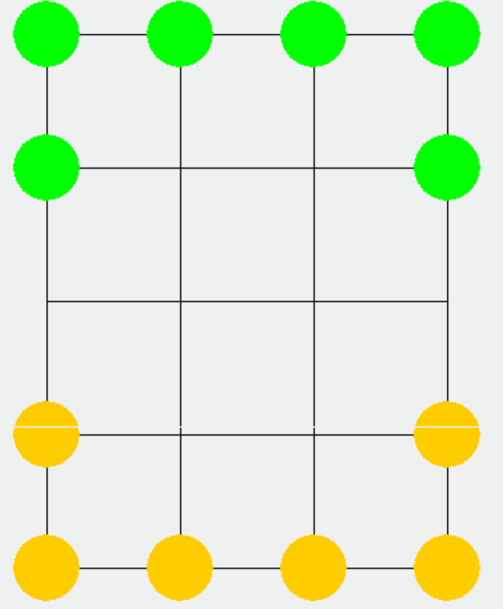
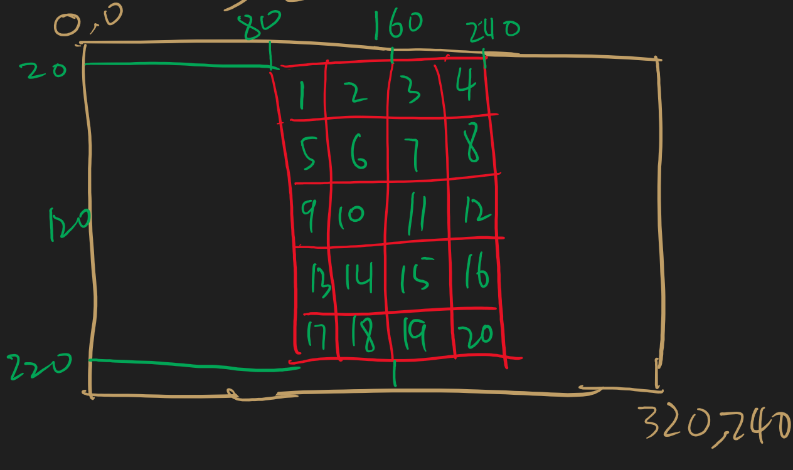

# 六子棋（二打一棋）

### 一 数据结构与数据类型

### **结构/定义**

``` c
//玩家状态定义
#define chooseChess 1
#define chooseDir 2
#define Rest 3


struct Player{    //表示玩家的【所有棋子的状态和坐标】【玩家状态】
int chess1State; 
… int chess6State;  //棋子1-6的状态，1表示还存活，0表示被吃掉了
int chess1X;
int chess1Y;
… int chess6X; 
int chess6Y;	//棋子1-6的坐标，使用在棋盘数组里的位置数值

int playerState; //玩家状态
//1：chooseChess待选棋子
//2：chooseDir选中方向
//3：Rest待机
};

```


### **全局变量**

**棋盘数组**
int CB[]：5行4列的数组

- 棋盘中

    - 0：空
    - 1：玩家1的棋子
    - 2：玩家2的棋子

- 初始棋盘：

    | 2    | 2    | 2    | 2    |
    | ---- | ---- | ---- | ---- |
    | 2    | 0    | 0    | 2    |
    | 0    | 0    | 0    | 0    |
    | 1    | 0    | 0    | 1    |
    | 1    | 1    | 1    | 1    |



**用于走棋的全局临时变量**

int cx：选中棋子的x坐标

int cy：选中棋子的y坐标

int gocx：棋子待走坐标x

int gocy：棋子待走坐标y

**棋子坐标**

STM32开发板LCD屏幕320*240pixels（横竖）

棋盘每格40*40pixels

显示效果：



> 以左上角起始像素点定位每一格的位置 
>
> 1:(80,20) 
>
> 2:(120,20)
>
> 3:(160,20)
>
> 4:(200:20)
>
> 
>
> 5:(80,60)
>
> 6:(120,60)
>
> 7:(160,60)
>
> 8:(200,60)
>
> 
>
> 9:(80,100)
>
> 10:(120,100)
>
> 11:(160,100)
>
> 12:(200,100)
>
> 
>
> 13:(80,140)
>
> 14:(120,140)
>
> 15:(160,140)
>
> 16:(200,140)
>
> 
>
> 17:(80,180)
>
> 18:(120,180)
>
> 19:(160,180)
>
> 20:(200,180)

**游戏状态**

enum gameState：游戏状态。

- 1：player1Turn玩家1回合（默认）
- 2：player2Turn玩家2回合
- 3：player1Win游戏结束（玩家1获胜）
- 4：player2Win游戏结束（玩家2获胜）


### 二 中断

**按键外部中断**


### 三 伪代码

**初始化**

``` c
/* 初始化系统时钟 */

/* 初始化LCD */
// 初始化棋盘矩阵
// 显示初始棋盘

/* 初始化按键 */
// 初始化玩家状态（玩家1为待选棋子，玩家2为待机）

/* 初始化数码管 */
// 根据gameState显示相应状态
```


**按键响应**

``` c
/* 按键响应 */
/* 使用6个按键实现选棋子 SW2 SW3 SW4 SW5 SW6 SW7 */
/* SW10上 SW14下 SW11左 SW15右 */
// 每个按键都使用如下代码，或者将playerState部分拆分

/* 选棋子 */	
//对其中一个按键，如SW2来说：
switch(gameState){
    case 1: //玩家1的回合
            if(Player1->chess1State == 1){
                // 若玩家1的第1个棋子还没被吃
                cx = Player1 -> chess1X;
                cy = Player1 -> chess1Y; //更新全局变量cx、cy为玩家1的第1个棋子的坐标
                Player1 -> PlayerState = chooseDir; //将玩家1的状态更新为待选方向
            }
        break;
        
    case 2: //玩家2的回合 
            if(Player2->chess1State == 1){
                //若玩家2的第1个棋子还没被吃
                cx = Player2 -> chess1X;
                cy = Player2 -> chess1Y;
                Player2 -> PlayerState = chooseDir;
            }
    case 3:
        //玩家1获胜
        break;
    case 4:
        //玩家2获胜
        break;
    default:
        break;
}

/* 选方向 */
// 以SW10为例，需要判断cx和cy上面一格是否越界、是否有其它棋子
switch(gameState){
    case 1:
        if(Player1->playerState == chooseDir){
            if(Player1->chess1State == 1){
                tempX = cx - 1;
                tempY = cy;
                if(cx >= 0){
                    // 若没有数组越界
                    if(CB[tempX, tempY] == 0){
                        //若对应位置没有棋子，可以移动
                        gocx = tempX;
                        gocy = tempY;
                    }
                }
            }
        }
        
    case 2:
        if(Player2->playerState == chooseDir){
            if(Player2->chess1State == 1){
                tempX = cx - 1;
                tempY = cy;
                if(cx >= 0){
                    // 若没有数组越界
                    if(CB[tempX, tempY] == 0){
                        //若对应位置没有棋子，可以移动
                        gocx = tempX;
                        gocy = tempY;
                    }
                }
            }
        }
}
```

**根据棋盘数组画棋盘函数**

``` c

```

> 1. 调用全屏清函数
> 2. 调用画格子函数
> 3. 调用画棋子函数

**全屏清函数**

``` c
// 全LCD屏置白色
// 调用作矩形函数清屏
```

**画格子函数**

``` c
/* 在LCD屏幕上作棋盘 */
// 调用作矩形函数画线条
// (80,20) - (240,19)
// (80,20) - ()
```

**画棋子函数**

``` c
/* 画棋子函数 */
if (Player1->chess1State == )
```


**作矩形函数**

``` c
// 循环调用打点函数（已给出）作矩形
void LCD_DrawRect(u16 ox, u16 oy, u16 ex, u16 ey, uint16_t GRB)
{
    
}
```

**打点函数（例程实现）**

``` c
void LCD_DrawPoint(u16 x,u16 y,uint16_t GRB)
	{
        LCD_SetCursor(x,y);
			  LCD_IO_WriteReg(0x2C);
			 	LCD_IO_WriteData(GRB);
	}
```

